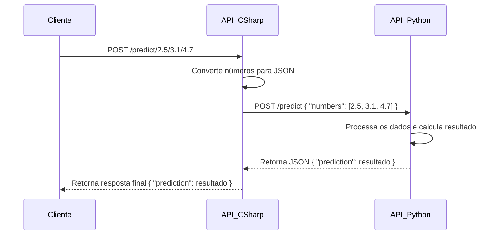

# Desafio Técnico: API Backend para Integração com Modelo de ML

## Introdução

Neste desafio, você criará duas APIs (em C# e Python) que se comunicam para realizar uma simulação de integração com um modelo de Machine Learning.

Você pode utilizar qualquer recurso disponível, incluindo IA como o ChatGPT, mas o foco será a estrutura do código, boas práticas e solução do problema.

---

## Objetivo

• Criar uma API em C# (ASP.NET Core) que receba números diretamente na rota /predict, faça um pré-processamento e envie um JSON para a API Python.  
• Criar uma API em Python (FastAPI ou Flask) que receba esse JSON e retorne um valor processado.  
• O resultado da API Python deve ser retornado ao usuário pela API C#.



---

## Requisitos

1. API em C# (dotnet 8)

   - Criar um endpoint POST /predict que recebe números individuais na URL, ex:

   ```
   POST http://localhost:5000/predict/2.5/3.1/4.7
   ```

   - Os números devem ser convertidos para um JSON no seguinte formato:

   ```
   {
   "numbers": [2.5, 3.1, 4.7]
   }
   ```

   - O JSON deve ser enviado para a API Python via requisição HTTP.
   - A resposta da API Python deve ser retornada para o cliente.

2. API em Python (3.11)

   - Criar um endpoint POST /predict que recebe um JSON contendo uma lista de números.
   - O cálculo de simulação do modelo de Machine Learning pode ser baseado em operações matemáticas simples sobre os números recebidos.
   - Retornar o resultado em JSON.

3. Testes
   - As APIs devem ser testáveis e rodáveis localmente.
   - Podem ser utilizados frameworks como Flask, FastAPI (Python) e ASP.NET Core (C#).

---

## Entrega Esperada

- Código-fonte a partir de um pull request de um fork deste repositório.
- Arquivo INSTRUCTIONS.md com instruções para rodar as APIs.
- Explicação rápida sobre as escolhas feitas no desenvolvimento.

---

Dicas

- Teste sua API com ferramentas como Postman ou curl.
- Use Docker se quiser rodar a API Python e C# de forma independente.
- Se quiser aprofundar, adicione logs estruturados e tratamento de erros.

Boa sorte! 🚀
